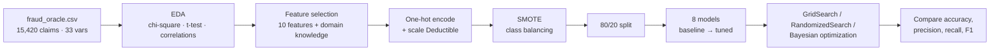

<div align="center">

# 🚗 Vehicle Insurance Claim Fraud Detection

**Benchmarking eight machine-learning models to flag fraudulent auto-insurance claims from policy and vehicle data.**


</div>

## Overview
Fraudulent claims (staged accidents, inflated damages) cost insurers heavily and push premiums up for honest customers. The question we set out to answer: **can historical vehicle and policy data reliably flag claims that need investigation?** Only ~6% of claims in the data are fraudulent, so the work focuses on handling class imbalance and on **recall for the fraud class**, since a missed fraud costs more than an extra review.

## 📊 Key Results
Accuracy on the held-out test split (5,799 claims), taken from the outputs of `Final Project SectionA-Team 1.ipynb`, after hyperparameter tuning:

| Model (tuned) | Accuracy | Fraud recall | Fraud F1 |
|---|---|---|---|
| **Random Forest** | **0.858** | 0.95 | 0.87 |
| **XGBoost** (Bayesian opt.) | **0.858** | 0.95 | 0.87 |
| **CatBoost** | 0.857 | 0.95 | 0.87 |
| Gradient Boosting | 0.856 | 0.94 | 0.87 |
| Decision Tree | 0.855 | 0.94 | 0.87 |
| K-Nearest Neighbors | 0.842 | 0.92 | 0.85 |
| Logistic Regression | 0.781 | 0.86 | 0.80 |
| Isolation Forest | 0.503 | 0.07 | 0.13 |

- Tree ensembles were the strongest group: **~95% of fraudulent claims caught** at 0.80 fraud precision.
- Unsupervised anomaly detection (Isolation Forest) failed on this problem, which supports a supervised approach.
- Chi-square tests and EDA showed **fault, policy type, vehicle category, base policy, and vehicle price** carry the strongest fraud signal.

> **Note:** SMOTE was applied before the train/test split, so the test set is class-balanced and contains synthetic samples. Scores are best read as a *relative* model comparison. Re-evaluating with SMOTE applied only to training folds is the next step.

## 🔧 Approach


## 🗂️ Dataset
**Vehicle Claim Fraud Detection** ([Kaggle](https://www.kaggle.com/datasets/shivamb/vehicle-claim-fraud-detection)): 15,420 claims, 33 categorical and numerical variables (accident timing, vehicle make/price/age, policy type, deductible, driver rating, past claims, and more). Target: `FraudFound_P`. A copy is included as `fraud_oracle.csv`.

## 🧰 Tech Stack
Python · pandas · NumPy · scikit-learn · XGBoost · CatBoost · imbalanced-learn (SMOTE) · scikit-optimize · SciPy · statsmodels · Matplotlib · Seaborn

## 📁 Repository Structure
```
ml-vehicle-fraud-detection/
├── Final Project SectionA-Team 1.ipynb   # final notebook (EDA → 8 models → comparison)
├── Final Project SectionA-Team 1.pdf     # notebook export
├── Final project SectionA-Team 1.pptx    # presentation deck
├── added-eda.ipynb                       # EDA iterations
├── revised-eda.ipynb
├── revised_eda_Rev2.ipynb
├── main.ipynb                            # early data-loading scratch notebook
├── fraud_oracle.csv                      # dataset
├── project status form.pdf
└── LICENSE
```

## ▶️ How to Run
```bash
git clone https://github.com/oxayavongsa/ml-vehicle-fraud-detection.git
cd ml-vehicle-fraud-detection
pip install pandas numpy scipy statsmodels scikit-learn imbalanced-learn xgboost catboost scikit-optimize matplotlib seaborn notebook
jupyter notebook "Final Project SectionA-Team 1.ipynb"
```
The notebook reads `fraud_oracle.csv` from the repo root, so no download is needed.

## 🎥 Presentation
[Project video on YouTube](https://youtu.be/TztlKFz5VXU?si=MeweLXnsnQG7GRCP)

## 👥 Team
- **Outhai Xayavongsa (Thai)**, Team Leader
- **Aaron Ramirez**, Technical Lead
- **Muhammad Haris**

Course: AAI-510 Machine Learning, University of San Diego (M.S. Applied Artificial Intelligence)

## 📄 License
MIT. See [LICENSE](LICENSE).

---
<div align="center">
Built by <a href="https://github.com/oxayavongsa">Outhai (Thai) Xayavongsa</a> · <a href="https://oxayavongsa.github.io/ai-automation-portfolio/">Portfolio</a>
</div>
